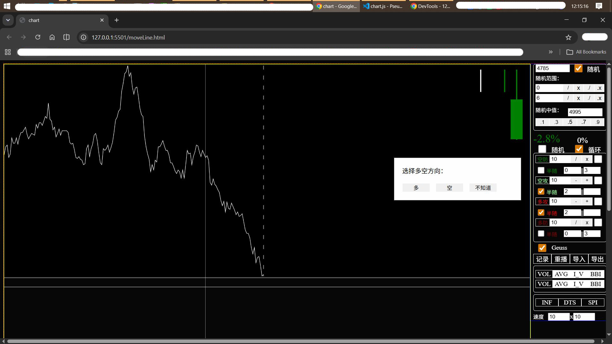
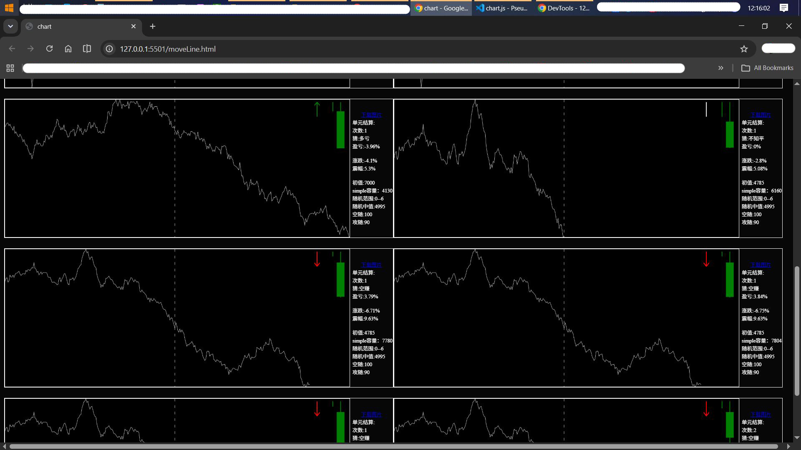
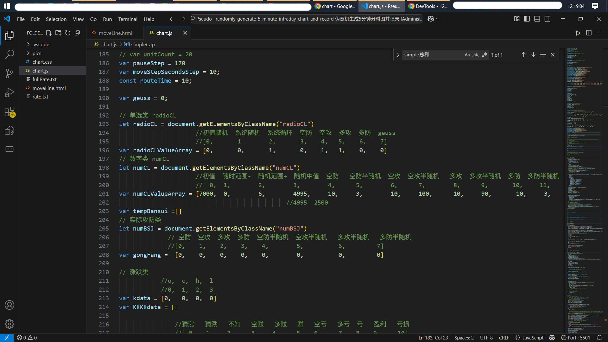
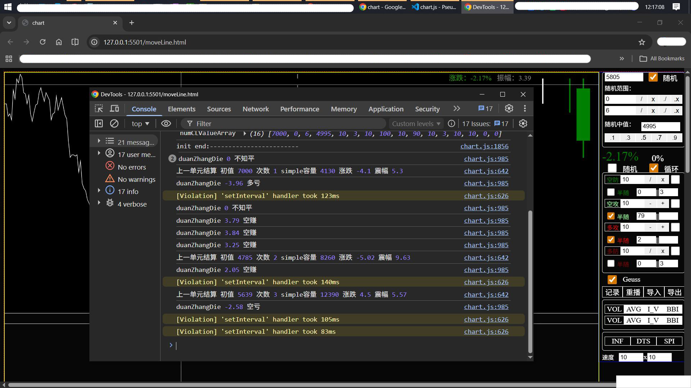
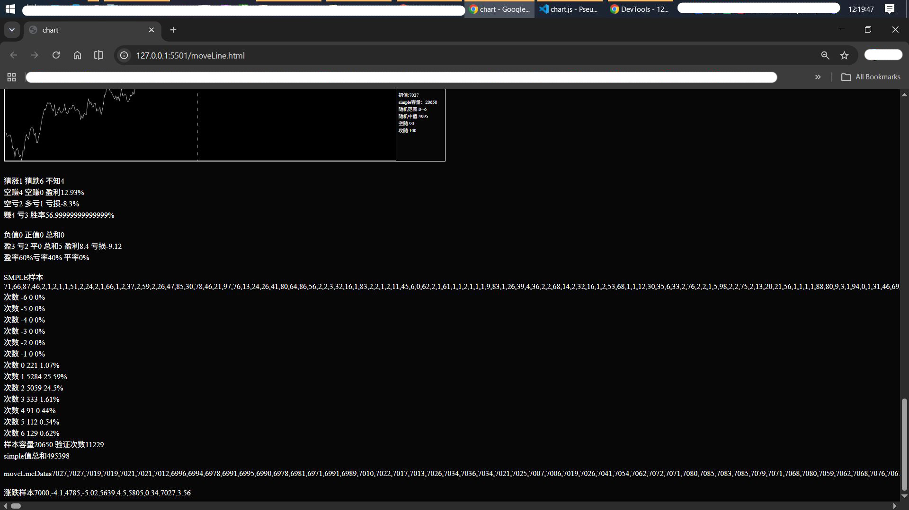

# Pseudo--randomly-generate-5-minute-intraday-chart-and-record-summarize
# 伪随机生成5分钟分时图并记录总结

This is a tool that conducts time-sharing graph analysis by pseudo-randomly generating data. Random positive skewness can be controlled to make it lean in a certain direction.
这是一个通过伪随机生成数据进行作分时图分析的工具。可以控制随机的正偏，使其偏向某一方向。

It has a summary function, can guess whether it is bullish or bearish, and can automatically or manually record images.
有总结功能，可猜多空，自动/手动记录图像。

In the code of chart.js, you can modify and configure the generation speed, frequency, sample size, etc. Among them, sample size is an important piece of data.
在chart.js的代码里可以修改和配置，生成的速度，次数，样本容量等，其中样本容量是一个重要的数据。

It might be necessary to check the status in combination with the output console.
结合输出控制台查看状态可能是必要的。

The readme document was manually written may not match the actual situation, It cannot be regarded as 100% correct.
readme文档为时隔半年后手动书写，可能与实际存在差别或者错别字，不能视为百分百正确。

！！！！！！！！Note that there may be unused code in the js content. Please be careful to distinguish.
！！！！！！！！注意，js内容存在未使用的代码，注意甄别。
---

## Quick Start
## 快速运行

Download all project files locally without changing the directory structure.
将本项目所有文件，不动结构，下载至本地。

Just double-click moveLine.html to go to your browser and run it. By default, it is generated in a loop with a fixed initial value.
直接双击moveLine.html转到浏览器运行。默认循环生成，初值固定。

---

## Features
## 功能特性

-  **stochastic control**
-  **随机控制**

-  **picture recorder**
-  **图像记录**

-  **Summary and statistics**
-  **总结统计**

---

## Tech Stack
## 技术栈

| 类别 | 技术 |
| Category | Technology |
|----------|------------|
| Frontend | JavaScript, HTML5 Canvas |
| 前端 | JavaScript，HTML5 Canvas |
---

## Screenshots
## 截图

---

## License
## 许可证

This project is open-sourced under the [MIT License](LICENSE).
本项目采用 [MIT 许可证](LICENSE) 开源。

Copyright (c) 2026 gikmoogie

---

## Contact
## 联系方式

- GitHub: [@gikmoogie](https://github.com/gikmoogie)

---
> Any questions, please feel free to contact. reply when i see it
> 有任何问题可联系，看到会回复
